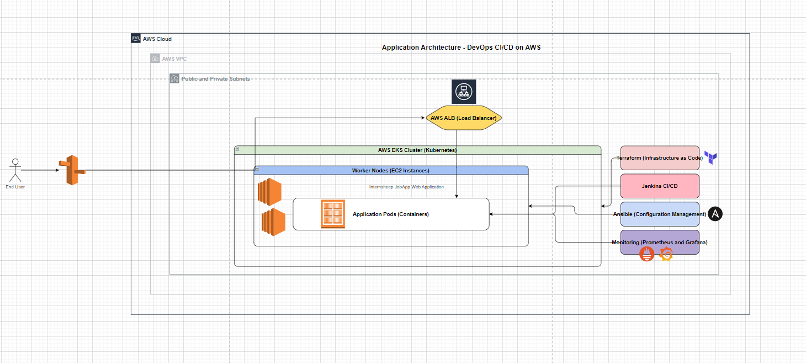

# Devops_Capstone_4

## Objective
 End-to-End DevOps Pipeline for a Web Application with CI/CD

---

## Problem Statement: [ProblemStatement.md](ProblemStatement.md)

---

## Application API documentation: [backend/README.md](backend/README.md)

---

## Prerequisites
- Fork the repository https://github.com/UnpredictablePrashant/JobsApp.git to your github account

---

## Instructions

### 1. Architecture Design, Dockerization, and Jenkins Setup
1. Design Application Architecture
    - Use AWS EKS for Kubernetes cluster management.
    - Deploy a web application containerized with Docker.
    - Store container images in AWS ECR.
    - Use Terraform for Infrastructure as Code (IaC).
    - Automate configuration with Ansible.
    - Monitor with Prometheus & Grafana.
    
    - Draw.io architecture diagram can be found at [Capstone.drawio](Capstone.drawio)
2. Dockerize the Web Applicaton
    - Clone the forked repository to your local using 
    ```bash
        git clone <repositoryurl>
    ```
    - This application contains 3 services: Auth Service, User Service and Company Service, designed for managing user authentication, profile details of users and company. Create a docker file for each service
    - Build each docker image
    ``` bash
    cd backend
    docker build -t jobsapp-authservice:latest ./authService
    docker build -t jobsapp-userservice:latest ./userService
    docker build -t jobsapp-companyservice:latest ./companyService
    ```
    - Tag the created docker images
    ``` bash
    aws configure
    aws ecr create-repository --repository-name ssy-jobsapp
    docker tag jobsapp-authservice:latest 975050024946.dkr.ecr.us-east-1.amazonaws.com/ssy-jobsapp:jobsapp-authservice
    docker tag jobsapp-userservice:latest 975050024946.dkr.ecr.us-east-1.amazonaws.com/ssy-jobsapp:jobsapp-userservice
    docker tag jobsapp-companyservice:latest 975050024946.dkr.ecr.us-east-1.amazonaws.com/ssy-jobsapp:jobsapp-companyservice
    ```
    - Push the images to the ECR
    ``` bash
    aws ecr get-login-password --region us-east-1 | docker login --username AWS --password-stdin 975050024946.dkr.ecr.us-east-1.amazonaws.com
    docker push 975050024946.dkr.ecr.us-east-1.amazonaws.com/ssy-jobsapp:jobsapp-authservice
    docker push 975050024946.dkr.ecr.us-east-1.amazonaws.com/ssy-jobsapp:jobsapp-userservice
    docker push 975050024946.dkr.ecr.us-east-1.amazonaws.com/ssy-jobsapp:jobsapp-companyservice
    ```
3. Setup Jenkins on EC2
    - Create an EC2 instance - Amazon Linux 2, t2.micro, and allow the port 8080 for Jenkins
    - 1. Login to the created EC2 instance
        - Install Java (Required for Jenkins)
        ```bash
            sudo yum update -y
            sudo yum install -y java-11-amazon-corretto
        ```
        - Add Jenkins repository
        ```bash
            sudo wget -O /etc/yum.repos.d/jenkins.repo https://pkg.jenkins.io/redhat-stable/jenkins.repo
            sudo rpm --import https://pkg.jenkins.io/redhat-stable/jenkins.io-2023.key
        ```
        - Install & Start Jenkins
        ```bash
            sudo yum install -y jenkins
            sudo systemctl start jenkins
            sudo systemctl enable jenkins
        ```
        - Access Jenkins
        Get the initial password from 
        ```bash
        sudo cat /var/lib/jenkins/secrets/initialAdminPassword
        ```
        - Open Jenkins in the browser: http://<ipaddress>:8080/ and enter the copied password and setup an admin user
        - Install the required plugins - Git, Github, Docker Pipeline, AWS CLI, Kubernetes CLI, Terraform
        - Configure credentials for AWS, DockerHub, and GitHub - Go to Jenkins Dashboard -> Manage Jenkins -> Credentials -> System -> Global credentials (unrestricted) -> Add Credentials

---

### 2. AWS Infrastructure Provisioning with Terraform and Jenkins Integration
1. Write Terraform scripts for AWS Resources
